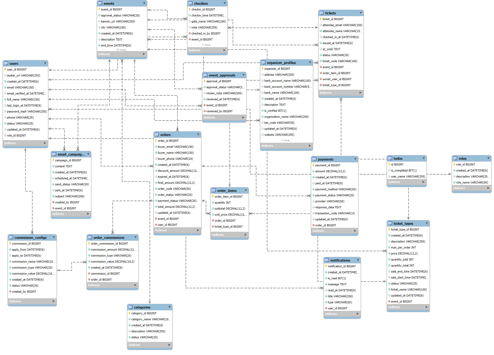

# Thiết Kế Cơ Sở Dữ Liệu

## 1. ERD tổng thể

---

## 2. Mục tiêu thiết kế

Cơ sở dữ liệu của hệ thống quản lý sự kiện được thiết kế để phục vụ trọn vẹn các luồng nghiệp vụ chính: quản lý người dùng theo vai trò, tạo và duyệt sự kiện, bán vé, thanh toán, phát hành e-ticket, check-in tại cổng, gửi email thông báo và tính commission cho nền tảng.

Thiết kế này ưu tiên ba mục tiêu:

- tách rõ các nhóm dữ liệu theo từng miền nghiệp vụ
- đảm bảo tính toàn vẹn khi giao dịch mua vé và check-in diễn ra liên tục
- hỗ trợ truy vấn báo cáo cho Organizer và Admin mà không phải lưu dữ liệu dư thừa quá mức

---

## 3. Phân nhóm thực thể

### 3.1. Nhóm người dùng và phân quyền

Các bảng lõi của nhóm này là `roles`, `users`, `organizer_profiles`.

- `roles` lưu danh mục vai trò hệ thống như `ATTENDEE`, `ORGANIZER`, `ADMIN`
- `users` là bảng người dùng trung tâm, chứa thông tin đăng nhập và hồ sơ cơ bản như email, họ tên, số điện thoại, trạng thái tài khoản
- `organizer_profiles` tách riêng phần thông tin nghiệp vụ của nhà tổ chức như tên tổ chức, mã số thuế, website, tài khoản ngân hàng, trạng thái xác minh

Lý do tách `organizer_profiles` khỏi `users` là hợp lý vì không phải người dùng nào cũng là Organizer. Cách tách này giữ cho bảng `users` gọn, tránh nhiều cột rỗng, đồng thời thể hiện đúng quan hệ `1-1` giữa một tài khoản Organizer và hồ sơ tổ chức của họ.

### 3.2. Nhóm danh mục và sự kiện

Các bảng chính là `categories`, `events`, `event_approvals`.

- `categories` quản lý nhóm sự kiện như âm nhạc, thể thao, công nghệ
- `events` là thực thể trung tâm của toàn bộ hệ thống
- `event_approvals` lưu vết các lần Admin duyệt hoặc từ chối sự kiện

Bảng `events` đang chứa đầy đủ các thuộc tính quan trọng:

- thông tin hiển thị: `title`, `slug`, `short_description`, `description`, `banner_url`
- thông tin địa điểm: `venue_name`, `venue_address`, `city`, `location_type`, `meeting_url`
- thông tin thời gian: `start_time`, `end_time`, `registration_deadline`
- trạng thái nghiệp vụ: `publish_status`, `approval_status`

Thiết kế này phản ánh đúng vòng đời sự kiện trong hệ thống: Organizer tạo sự kiện, Admin duyệt, sau đó Organizer mới publish để Attendee có thể tìm thấy và mua vé.

Việc tách `event_approvals` khỏi `events` cũng là điểm đúng về mặt thiết kế, vì:

- lưu được lịch sử duyệt nhiều lần
- biết Admin nào đã xử lý
- lưu được `review_note` cho từng lần duyệt
- tránh làm bảng `events` phải gánh dữ liệu lịch sử

### 3.3. Nhóm vé và bán vé

Các bảng chính là `ticket_types`, `orders`, `order_items`, `tickets`.

Đây là phần quan trọng nhất của hệ thống, và thiết kế hiện tại đi đúng hướng theo mô hình thương mại điện tử:

- `ticket_types`: định nghĩa từng loại vé của một sự kiện
- `orders`: phần đầu đơn hàng, lưu người mua, sự kiện, tổng tiền, trạng thái đơn và thanh toán
- `order_items`: chi tiết từng loại vé trong đơn hàng
- `tickets`: vé thực tế được phát hành cho từng người tham dự sau khi thanh toán thành công

Thiết kế tách `orders` và `order_items` là cần thiết vì:

- một đơn hàng có thể chứa nhiều loại vé
- giá vé tại thời điểm mua phải được chốt ở `order_items.unit_price`
- hỗ trợ tính `subtotal` cho từng dòng và `final_amount` cho toàn đơn

Việc có thêm bảng `tickets` riêng biệt cũng là bắt buộc trong domain này, vì một dòng `order_item` mua số lượng `n` cần sinh ra `n` vé riêng lẻ. Mỗi vé phải có:

- mã vé duy nhất `ticket_code`
- mã QR riêng `qr_code`
- người sở hữu và người tham dự
- trạng thái sử dụng như `VALID`, `CHECKED_IN`, hoặc trạng thái tương đương theo enum

Nhờ vậy hệ thống mới có thể xử lý đúng các bài toán:

- một người mua nhiều vé cho nhiều người tham dự khác nhau
- check-in theo từng vé, không phải theo cả đơn hàng
- gửi lại e-ticket hoặc tra cứu từng vé độc lập

### 3.4. Nhóm thanh toán và doanh thu nền tảng

Các bảng chính là `payments`, `commission_configs`, `order_commissions`.

- `payments` lưu kết quả giao dịch thanh toán của từng đơn hàng
- `commission_configs` lưu cấu hình commission do Admin thiết lập theo từng giai đoạn
- `order_commissions` chốt số tiền commission thực tế áp dụng cho từng đơn

Quan hệ `1-1` giữa `orders` và `payments` là phù hợp với thiết kế hiện tại, vì mỗi đơn hàng được gắn với một giao dịch thanh toán chính.

Điểm tốt trong mô hình này là không chỉ lưu cấu hình commission hiện hành, mà còn có bảng `order_commissions` để snapshot commission tại thời điểm phát sinh đơn hàng. Đây là cách làm đúng để tránh sai lệch báo cáo khi commission về sau bị thay đổi.

### 3.5. Nhóm vận hành sự kiện

Các bảng `checkins`, `email_campaigns`, `notifications` phục vụ giai đoạn sau bán vé.

- `checkins` ghi nhận mỗi lần quét vé vào cổng, ai là người check-in, tại cổng nào, thời điểm nào
- `email_campaigns` quản lý các đợt gửi email hàng loạt của Organizer theo từng sự kiện
- `notifications` lưu thông báo trong hệ thống cho từng người dùng

Nhóm này cho thấy database không chỉ phục vụ CRUD cơ bản mà còn hỗ trợ vận hành thực tế của sự kiện sau khi vé đã được bán.

---

## 4. Phân tích các quan hệ chính

### 4.1. `roles` 1-n `users`

Một vai trò có thể gán cho nhiều người dùng, còn mỗi người dùng hiện tại chỉ thuộc một vai trò chính. Mô hình này đơn giản, đủ dùng cho hệ thống có phân quyền tĩnh theo ba nhóm actor.

### 4.2. `users` 1-1 `organizer_profiles`

Quan hệ này giúp phân biệt rõ tài khoản đăng nhập và hồ sơ doanh nghiệp/tổ chức. Đây là lựa chọn phù hợp cho bài toán nhiều role nhưng chỉ Organizer mới cần metadata mở rộng.

### 4.3. `organizer_profiles` 1-n `events`

Một Organizer có thể tạo nhiều sự kiện, nhưng một sự kiện chỉ thuộc một Organizer. Quan hệ này là quan hệ gốc của toàn bộ phần nghiệp vụ tổ chức sự kiện.

### 4.4. `categories` 1-n `events`

Mỗi sự kiện thuộc một danh mục duy nhất. Thiết kế này đủ tốt cho hệ thống hiện tại vì hỗ trợ lọc, phân loại và thống kê. Nếu về sau cần gắn nhiều danh mục cho một sự kiện thì mới cần chuyển sang bảng nối nhiều-nhiều.

### 4.5. `events` 1-n `ticket_types`

Một sự kiện có nhiều loại vé với mức giá, thời gian mở bán và hạn mức khác nhau. Đây là mô hình đúng cho các sự kiện có nhiều hạng vé như Standard, VIP, Early Bird.

### 4.6. `users` 1-n `orders`

Một Attendee có thể tạo nhiều đơn hàng theo thời gian. Trong khi đó, mỗi đơn hàng chỉ thuộc về một người mua chính.

### 4.7. `events` 1-n `orders`

Mỗi đơn hàng gắn với một sự kiện duy nhất. Điều này làm luồng thanh toán đơn giản hơn và phù hợp với trải nghiệm phổ biến của hệ thống bán vé sự kiện.

### 4.8. `orders` 1-n `order_items` và `ticket_types` 1-n `order_items`

`order_items` là bảng nối nghiệp vụ giữa đơn hàng và loại vé, đồng thời chốt dữ liệu phát sinh tại thời điểm mua như đơn giá, số lượng, thành tiền.

### 4.9. `order_items` 1-n `tickets`

Đây là quan hệ then chốt để chuyển từ "mua số lượng" sang "phát hành từng vé". Nhờ quan hệ này, mỗi vé trở thành một thực thể độc lập có thể check-in và theo dõi trạng thái riêng.

### 4.10. `orders` 1-1 `payments`

Thiết kế phù hợp cho hệ thống hiện tại vì một đơn hàng chỉ có một kết quả thanh toán chính. Nếu sau này cần hỗ trợ retry nhiều giao dịch trên cùng một order, có thể phải nới thành `1-n`.

### 4.11. `tickets` 1-n `checkins`

Về mô hình dữ liệu, lưu `1-n` giúp giữ được lịch sử quét vé. Tuy nhiên về nghiệp vụ, hệ thống cần đảm bảo một vé hợp lệ chỉ được check-in thành công một lần trong hầu hết trường hợp.

### 4.12. `events` 1-n `event_approvals` và `users` 1-n `event_approvals`

Quan hệ này cho phép truy ra:

- sự kiện nào đã được duyệt bao nhiêu lần
- ai là Admin xử lý
- kết quả duyệt và ghi chú từng lần

### 4.13. `events` 1-n `email_campaigns`

Mỗi sự kiện có thể có nhiều chiến dịch gửi email: nhắc lịch, đổi địa điểm, thông báo cập nhật chương trình. Bảng này hỗ trợ tốt cho nhu cầu truyền thông sau khi đã có danh sách người đăng ký.

---

